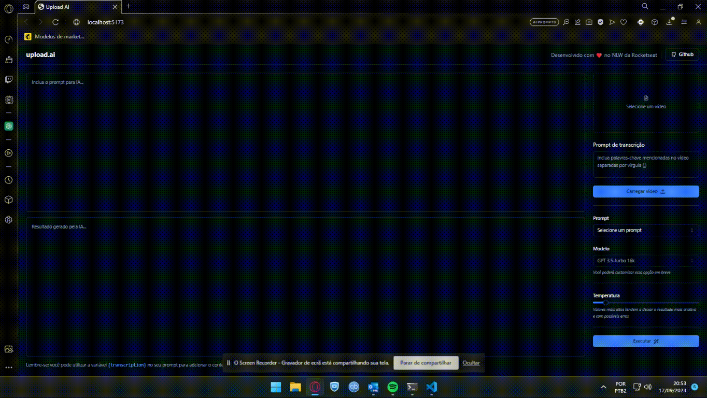

<h1 align="center">🤖 Upload AI</h1>

  <strong>Playground AI, o usuário adicionar um vídeo e escolhe as opções no prompt e a Inteligência Artificial irá mostrar os resultados gerados</strong>
   

  

## Tecnologias: 🚀
- React
- TypeScript
- TailwindCSS
- NodeJS

## Referências: ⌨️

- [Certificado]([https://www.figma.com/community/file/1192839311185193574](https://app.rocketseat.com.br/certificates/3ac5076a-fba3-492d-9617-219f564a7729)https://app.rocketseat.com.br/certificates/3ac5076a-fba3-492d-9617-219f564a7729)
